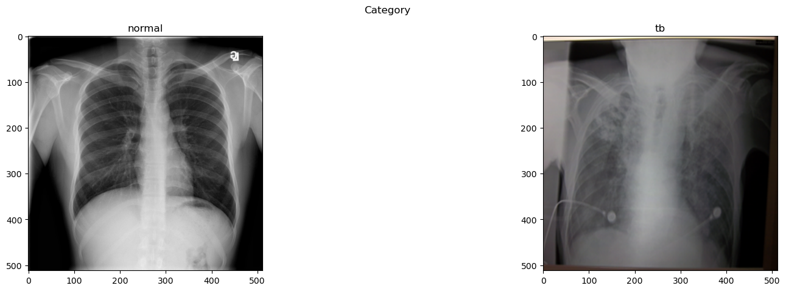
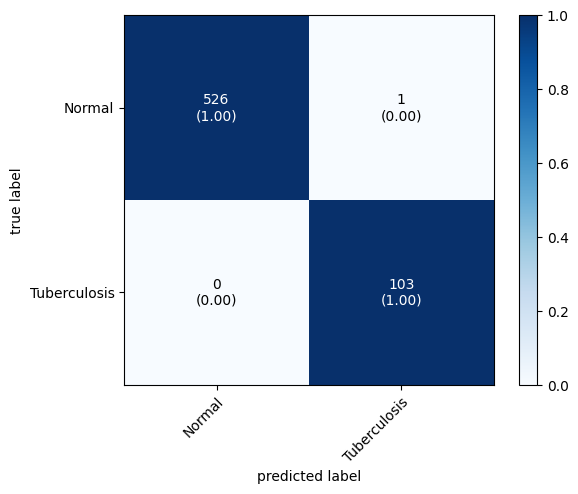

# Tuberculosis detection using A.I.



## Data  

The data was borrowed from Kaggle. You can access the Tuberculosis dataset from the link below  
[https://www.kaggle.com/datasets/tawsifurrahman/tuberculosis-tb-chest-xray-dataset](https://www.kaggle.com/datasets/tawsifurrahman/tuberculosis-tb-chest-xray-dataset)   
Make sure you have the data in the correct path that is put it in the notebook to run properly.


## Requirements  

Libraries needed for this project
```
numpy
pandas
matplotlib
opencv
scikit-learn
tensorflow
keras
mlxtend
```

if you are using conda you can import our environment.yml in the repo.
```
conda env create -f environment.yaml
```

## Results
We are proud to achieve 100% accuracy with our model with the data that we have. If you try to test it yourself you may get a high accuracy but it may not be as high as ours. That is normal. If we test our model on larger diverce dataset our accuracy would probably decrease. We got this 100% in one of our tries training the model.     



